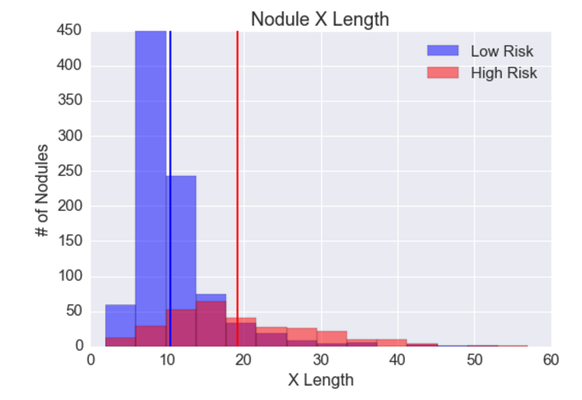
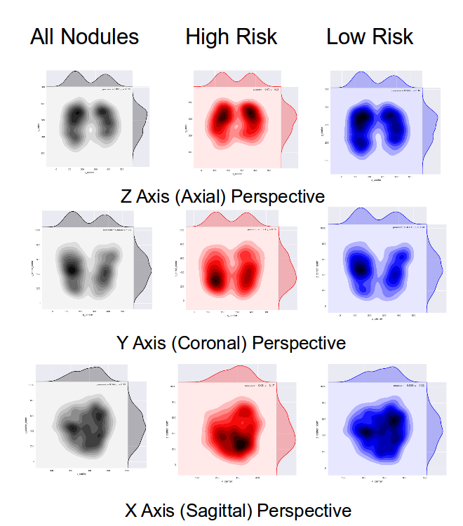

# Data

The last feature to be added is the Machine Learning pipeline.  However Saké is the framework that will enable the generation of the data that can be fed into the ML algorithms.  This forces us to look for data of comparable quality.  The National Cancer Institute (NCI) offers DICOM representations of lung cancer screening CT scans and XML-stored pixelwise annotations.  After significant cleaning of the 124GBs of data, the dataset contains 725 patients, 1,201 nodules, and 7,274 region of interest (ROI).

We next visualize the data and find that 1) larger nodules tend to be more likely malignant and 2) positional trends in nodule formation.  Such visualizations and analysis are comparable to recent medical science journal articles: i) *Distribution of Solid Solitary Pulmonary Nodules within the Lungs on Computed Tomography* (2016) ii) *Probability of Cancer in Pulmonary Nodules Detected on First Screening CT* (2013).

**Larger Nodules Tend to be More Likely Malignant**
{:class="img-responsive"}

**Positional Trends in Nodule Formation**
{:class="img-responsive"}

With ML-usable data now available, we proceed in producing a ML pipeline

# Smart Server

### Implementation: Machine Learning

Given this is but a semester project and our top priority is the segmentation/annotation framework, we have a limited amount of time to produce a Machine Learning pipeline.  We decide on two relatively simplistic yet respectable Machine Learning approaches: 

- Compute percentiles that the area and location of each ROI falls within using multivariate kernel density estimation. 
- Predict the probability that a nodule is malignant based off its shape. Approach involves 3-D convolutional neural network that detects the contours of each annotation.
- **Inspiration:** Olaf Ronneberger, Philipp Fischer, Thomas Brox, *U-Net: Convolutional Networks for Biomedical Image Segmentation*

{:class="img-responsive"}
